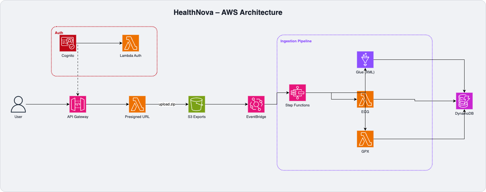

# HealthNova Backend

AWS serverless backend for processing Apple Health data exports and generating preventive health insights, with a focus on cardiovascular risk detection.

## What it does

HealthNova analyzes your Apple Health `export.zip` to surface early warning signals for potential cardiac issues. It processes:

- **Health records** (`exportar.xml`) — heart rate, HRV, blood pressure, SpO2, sleep
- **ECG data** (`electrocardiograms/*.csv`) — atrial fibrillation detection
- **Workout routes** (`workout-routes/*.gpx`) — GPS and exercise data

Once uploaded, the backend runs a parallel ingestion pipeline and stores normalized health records in DynamoDB, ready to be served to a dashboard or mobile app.

## Architecture



### AWS Services used

| Service | Purpose |
|---|---|
| API Gateway | REST API with JWT authorizer |
| Cognito | User authentication |
| S3 | Health export storage (versioned, encrypted) |
| Lambda | API handlers + ingestion workers |
| Step Functions | Ingestion orchestration |
| AWS Glue | Streaming XML parser (handles 500 MB+ files) |
| DynamoDB | Health records + user + process tables |
| EventBridge | S3 → Step Functions trigger |
| CloudWatch | Logs + alarms |

## Prerequisites

- [Node.js](https://nodejs.org/) 22+
- [AWS CLI](https://aws.amazon.com/cli/) configured with credentials
- [AWS CDK v2](https://docs.aws.amazon.com/cdk/v2/guide/getting_started.html) installed globally
- Python 3.12 (for Lambda functions, optional for local development)
- An AWS account with permissions to create IAM roles, Lambda, DynamoDB, S3, Cognito, Step Functions, Glue, and API Gateway

## Installation

### 1. Clone the repository

```bash
git clone https://github.com/your-org/healthnova-backend.git
cd healthnova-backend
```

### 2. Install dependencies

```bash
npm install
```

### 3. Configure environment variables

```bash
cp .env.example .env
```

Edit `.env` with your values:

```env
# Core app
ENV_NAME=dev
PROJECT_NAME=healthnova
AWS_ACCOUNT_ID=xxxxxxxx672
AWS_REGION=us-east-1

# CORS Configuration
CORS_ALLOWED_ORIGINS=https://app.mydomain.com,http://localhost:3000
CORS_ALLOWED_METHODS=GET,POST,PUT,DELETE,OPTIONS
CORS_ALLOWED_HEADERS=Content-Type,Authorization,X-Requested-With,Accept,Origin,X-Api-Key
CORS_MAX_AGE=86400

# Health Data Ingestion
EXPORTS_BUCKET_NAME=your-bucket-name
PRESIGNED_URL_EXPIRY_SECONDS=3600
```

To find your AWS account ID:

```bash
aws sts get-caller-identity --query Account --output text
```

### 4. Bootstrap CDK (first time only)

CDK needs to provision some resources in your account before deploying. Run this once per account/region:

```bash
npx cdk bootstrap aws://YOUR_ACCOUNT_ID/YOUR_REGION
```

Example:

```bash
npx cdk bootstrap aws://xxxxxxxx672/us-east-1
```

### 5. Build

```bash
npm run build
```

### 6. Preview changes

```bash
npx cdk diff
```

### 7. Deploy

```bash
npx cdk deploy
```

CDK will show you all resources it will create and ask for confirmation before deploying IAM changes.

After a successful deploy, the CLI will output:

- **API Gateway URL** — use this as your backend endpoint
- **Cognito User Pool ID** — needed for frontend auth configuration
- **Cognito App Client ID** — needed for frontend auth configuration

## Project structure

```
/bin                    # CDK app entry point
/lib
  /construct            # Reusable CDK constructs (Lambda, S3, DynamoDB, etc.)
  /stack                # Stack definitions by service
    /s3                 # S3 buckets (exports + photos)
    /dynamo             # DynamoDB tables
    /cognito            # User Pool + App Client
    /rest-api           # API Gateway + Lambda authorizer
    /step-functions     # Ingestion state machine
    /glue               # XML processing job
    /layer              # Lambda layers
    /shared/policy      # IAM policy builders
/src
  /lambda
    /core               # API handlers (presigned URL, process, authorizer, 404)
    /user               # Cognito triggers (pre-signup, post-confirmation)
    /ingestion          # Ingestion workers (validate, manifest, ECG, GPX, mark-complete)
  /layer
    /python-common      # Shared Python layer (logger, response helpers, CORS)
  /glue                 # Glue ETL scripts for XML streaming
/test                   # CDK unit tests
/openspec               # OpenSpec workflow artifacts
/docs                   # Additional documentation
```

## Ingestion pipeline

When a user uploads an `export.zip`, the Step Functions state machine runs five steps:

1. **ParseInput** — extracts `userId` and `jobId` from the S3 key
2. **ValidateFile** — checks ZIP integrity and size (max 2 GB) without loading the full file into memory
3. **ExtractManifest** — lists all files inside the ZIP
4. **ParallelParsing** — three branches run simultaneously:
   - **Glue job** streams `exportar.xml` and writes health records to DynamoDB
   - **ECG Lambda** parses ECG CSVs and flags atrial fibrillation patterns
   - **GPX Lambda** parses workout route files
5. **MarkComplete** — writes final job status to DynamoDB

## API endpoints

| Method | Path | Description |
|---|---|---|
| `POST` | `/upload/presigned-url` | Get a presigned S3 PUT URL to upload an export |
| `POST` | `/photobook/process` | Trigger photo processing |

All endpoints require a valid Cognito JWT in the `Authorization` header.

## Health metrics tracked

- Heart rate & heart rate variability (HRV)
- Blood pressure & oxygen saturation (SpO2)
- ECG / atrial fibrillation detection
- Sleep analysis & quality scoring
- Activity levels & workout performance
- Cardiovascular risk scoring

## Common commands

```bash
npm run build          # Compile TypeScript
npm test               # Run CDK unit tests
npx cdk diff           # Show pending infrastructure changes
npx cdk deploy         # Deploy to AWS
npx cdk synth          # Synthesize CloudFormation template
npx cdk destroy        # Tear down all resources
```

## Destroying the stack

To remove all AWS resources created by this project:

```bash
npx cdk destroy
```

> **Note:** S3 buckets with data will not be deleted automatically. You will need to empty them manually in the AWS Console or with the CLI before they can be removed.

## Security

- All data encrypted at rest (S3 SSE, DynamoDB default encryption)
- All traffic encrypted in transit (HTTPS enforced on S3 and API Gateway)
- Least-privilege IAM roles per Lambda function
- Presigned URLs expire after 1 hour
- No PHI written to CloudWatch logs
- Cognito JWT validation on every API request

## License

MIT — see [LICENSE](LICENSE).
